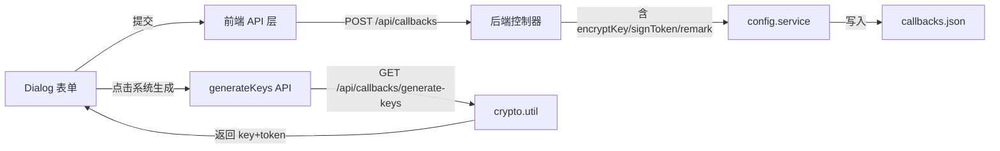
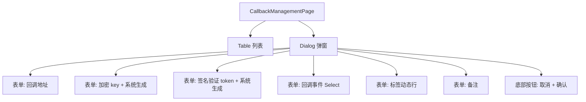

## 产品概述

参考腾讯电子签官方回调配置弹窗的设计，重构当前回调地址配置页面的新增/编辑表单，将 Drawer 抽屉改为 Dialog 弹窗，并调整表单字段和布局，使其与官方实现保持一致。

## 核心功能

1. **弹窗形式变更**：将当前 Drawer 侧边抽屉改为居中 Dialog 弹窗，标题为"回调配置"，右上角有关闭按钮
2. **指定回调地址**：必填字段，带信息提示图标(i)，右侧显示"查看回调通知文档"蓝色链接
3. **加密 key**：新增字段，带信息提示图标(i)，右侧显示"点击系统生成"蓝色链接按钮，点击后自动生成随机加密密钥
4. **签名验证 token**：新增字段，带信息提示图标(i)，右侧显示"点击系统生成"蓝色链接按钮，点击后自动生成随机签名 token
5. **回调事件**：下拉选择框，placeholder 为"请选择"，支持多选已有的消息类型列表
6. **标签**：支持通过"+ 新增一行"蓝色链接按钮动态添加多行标签输入
7. **备注**：新增文本输入字段
8. **表单布局**：采用左侧标签 + 右侧输入的水平对齐布局
9. **底部按钮**：居中排列"取消"和"确认"按钮，确认按钮为青绿色主题
10. **表格列调整**：表格新增回调事件、备注列的展示
11. **数据类型扩展**：前后端 DispatchConfig 类型同步新增 encryptKey、signToken、remark 字段
12. **后端新增生成密钥 API**：提供接口用于前端"点击系统生成"按钮调用，生成随机加密 key 和签名 token

## 技术栈

- **前端**：React 18 + TypeScript + TDesign React (v1.12) + Tailwind CSS + Vite
- **后端**：Node.js + Express + TypeScript
- **数据存储**：JSON 文件存储（config.service.ts 已有模式）

## 实现方案

### 整体策略

在现有项目架构基础上，通过扩展前后端类型定义、新增后端密钥生成 API、重构前端表单组件三个维度完成需求。前端将 Drawer 替换为 Dialog，表单布局从垂直布局改为水平标签-输入布局，新增 encryptKey/signToken/remark 字段及其交互逻辑。

### 关键技术决策

1. **密钥生成方案**：后端使用 Node.js 内置 `crypto.randomBytes` 生成 32 字节随机字符串作为 encryptKey（Base64 编码，43 字符，符合电子签 EncodingAESKey 规范），使用 `crypto.randomUUID` 或 `crypto.randomBytes(16).toString('hex')` 生成签名 token。复用已有的 `backend/src/utils/crypto.util.ts` 文件新增生成函数。
2. **Dialog 替代 Drawer**：TDesign React 的 Dialog 组件支持自定义 footer、宽度、关闭按钮等，完全满足需求。弹窗宽度设置为 600px 左右以匹配官方设计。
3. **表单布局**：使用 TDesign 的 Form + FormItem 组件的 `labelAlign="left"` 和 `labelWidth` 属性实现左标签右输入的水平布局，与官方截图一致。
4. **标签动态添加**：采用数组状态管理 + "新增一行"按钮的模式，每行为一个输入框 + 删除按钮，与官方截图中的交互方式一致。
5. **移除冗余字段**：原表单中的"配置名称"、"重试次数"、"超时时间"、"启用状态"、"自定义请求头"、"匹配规则"等字段在官方设计中不存在，但作为系统的分发配置仍有价值，保留在数据模型中，在弹窗中仅展示官方截图涉及的字段（url、encryptKey、signToken、msgTypes、tags、remark），其他字段使用合理默认值。

### 性能考虑

- 密钥生成在后端完成，避免前端 crypto API 的兼容性问题
- Dialog 组件按需渲染，不影响页面主体性能
- 标签动态行数量不设上限但实际使用不会太多，无性能瓶颈

## 实现细节

### 后端修改

1. **类型扩展**（`backend/src/types/config.types.ts`）：DispatchConfig 新增 `encryptKey?: string`、`signToken?: string`、`remark?: string` 三个可选字段
2. **密钥生成工具**（`backend/src/utils/crypto.util.ts`）：新增 `generateEncryptKey()` 和 `generateSignToken()` 函数
3. **控制器新增**（`backend/src/controllers/config.controller.ts`）：

- `createCallback` 解构新增 encryptKey、signToken、remark
- 新增 `generateKeys` 方法，返回随机生成的 encryptKey 和 signToken

4. **路由注册**（`backend/src/app.ts`）：新增 `GET /api/callbacks/generate-keys` 路由
5. **验证中间件**（`backend/src/middleware/validator.middleware.ts`）：`validateCallbackBody` 放宽 name 为可选（因为官方设计中无配置名称字段，可用 url 作为标识），或保留 name 字段使用回调地址自动填充

### 前端修改

1. **类型扩展**（`frontend/src/types/api.types.ts`）：DispatchConfig 新增 `encryptKey?: string`、`signToken?: string`、`remark?: string`
2. **API 层**（`frontend/src/lib/api.ts`）：新增 `generateKeys()` 函数调用后端生成密钥接口
3. **页面重构**（`frontend/src/pages/CallbackManagementPage.tsx`）：

- 替换 Drawer 为 Dialog
- 重写表单布局：水平标签-输入排列
- 表单字段按截图顺序：指定回调地址(必填) -> 加密 key -> 签名验证 token -> 回调事件 -> 标签 -> 备注
- "点击系统生成"按钮调用后端 API 填充 encryptKey/signToken
- 标签区域："+ 新增一行"动态添加输入行
- 底部按钮居中："取消" + "确认"（确认按钮青绿色主题）
- 表格列调整：新增回调事件列、备注列

## 架构设计

### 数据流



### 组件结构



## 目录结构

```
project-root/
├── backend/src/
│   ├── types/
│   │   └── config.types.ts          # [MODIFY] DispatchConfig 新增 encryptKey、signToken、remark 可选字段
│   ├── utils/
│   │   └── crypto.util.ts           # [MODIFY] 新增 generateEncryptKey() 和 generateSignToken() 函数，使用 crypto.randomBytes 生成安全随机字符串
│   ├── controllers/
│   │   └── config.controller.ts     # [MODIFY] createCallback 解构新增三个字段；新增 generateKeys 处理函数返回随机密钥对
│   ├── middleware/
│   │   └── validator.middleware.ts   # [MODIFY] validateCallbackBody 中 name 改为可选或使用默认值，url 验证保持不变
│   └── app.ts                       # [MODIFY] 新增 GET /api/callbacks/generate-keys 路由注册
├── frontend/src/
│   ├── types/
│   │   └── api.types.ts             # [MODIFY] DispatchConfig 新增 encryptKey、signToken、remark 可选字段
│   ├── lib/
│   │   └── api.ts                   # [MODIFY] 新增 generateKeys() 函数，调用 GET /api/callbacks/generate-keys
│   └── pages/
│       └── CallbackManagementPage.tsx # [MODIFY] 核心重构文件。Drawer 改为 Dialog；表单字段和布局按官方截图重新设计；表格列新增回调事件、备注
```

## 设计风格

参照腾讯电子签官方回调配置弹窗的设计语言，采用简洁、清晰的企业级表单设计风格。整体以白色为主背景，表单项采用左标签右输入的水平布局，视觉上干净整洁，信息层级分明。

## 页面设计

### 回调配置 Dialog 弹窗

#### 区块一：弹窗标题栏

- 左侧显示"回调配置"标题，字体加粗
- 右上角关闭按钮（X 图标），点击关闭弹窗
- 弹窗宽度约 600px，居中显示，带半透明遮罩层

#### 区块二：表单内容区域

- 整体内边距适中，表单项之间纵向间距一致（约 24px）
- 每个表单项：左侧标签固定宽度（约 120px），右对齐；右侧为输入控件
- **指定回调地址**：标签带红色星号(*)和灰色信息提示图标(i)，右侧为 Input 输入框（placeholder: "请输入"），输入框右侧紧跟"查看回调通知文档"青绿色链接文字
- **加密 key**：标签带灰色信息提示图标(i)，右侧为 Input 输入框（placeholder: "请输入"），输入框右侧紧跟"点击系统生成"青绿色链接文字
- **签名验证 token**：标签带灰色信息提示图标(i)，右侧为 Input 输入框（placeholder: "请输入"），输入框右侧紧跟"点击系统生成"青绿色链接文字
- **回调事件**：标签无额外图标，右侧为 Select 下拉多选框（placeholder: "请选择"），下拉选项为已有消息类型列表
- **标签**：标签文字，右侧显示一个加号圆形图标 + "新增一行"青绿色链接文字，点击后在下方新增一行输入框（带删除按钮），可动态添加多行
- **备注**：标签无额外图标，右侧为 Input 输入框（placeholder: "请输入"）

#### 区块三：底部操作按钮

- 按钮区域水平居中
- "取消"按钮：白色背景 + 灰色边框
- "确认"按钮：青绿色背景 + 白色文字，位于取消按钮右侧
- 两个按钮之间间距约 16px

### 表格列表页

- 保持现有表格整体布局不变
- 表格列增加"回调事件"列（显示已选择的事件标签）和"备注"列
- 调整列宽使新增列有足够展示空间