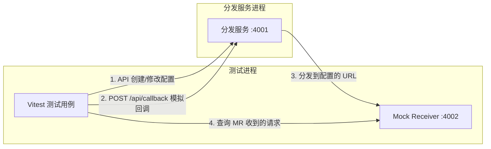
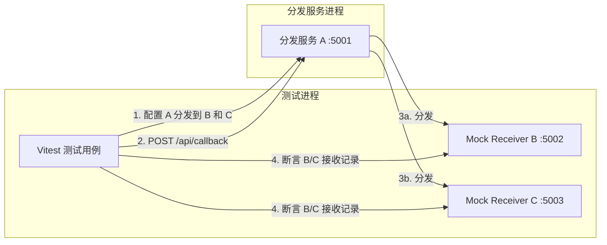
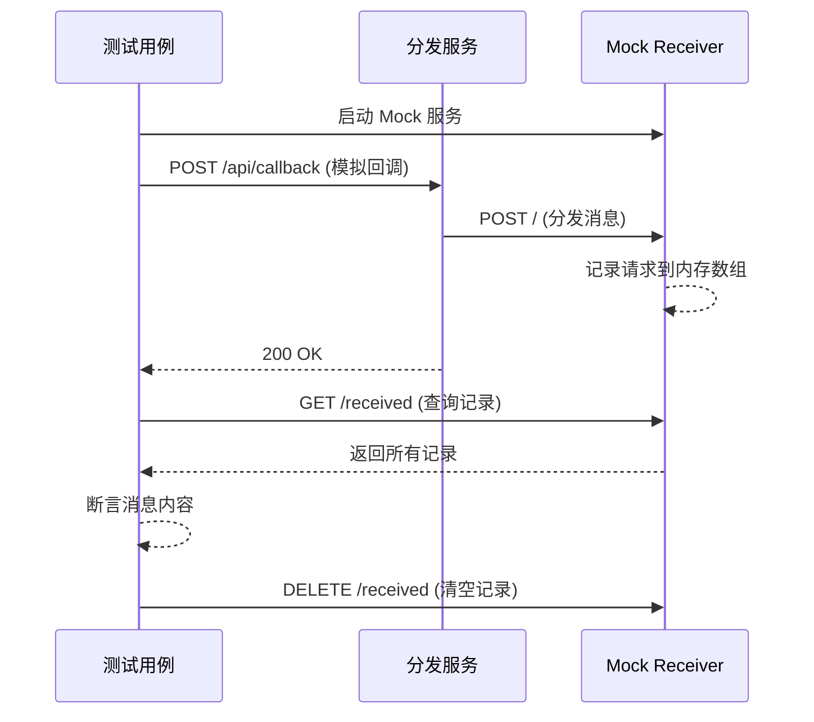

## 产品概述

为腾讯电子签回调分发服务制定完整的测试计划，包含 E2E 测试和集成测试两大部分，确保服务的配置变更能实时生效，以及多实例分发链路正确运转。

## 核心功能

### E2E 测试

- 通过 API 创建/修改/删除/启用/禁用回调配置，发送模拟回调消息，验证配置变更实时生效
- 验证 msgTypes 事件过滤功能：选中的事件能被分发，未选中的被拦截
- 验证 unknownMsgTypePolicy 策略：未知事件类型在 dispatch 策略下能分发、discard 策略下被丢弃
- 验证标签匹配规则：有 tags 和 matchRules 的回调配置能正确过滤消息

### 集成测试

- 启动三个分发服务实例（A:3001 分发服务、B:3002 接收者 1、C:3003 接收者 2）
- 实例 A 配置将消息分发到 B 和 C
- 模拟腾讯电子签 POST 回调到 A，验证 B 和 C 正确接收
- 验证启用/禁用某个下游时分发行为变化
- 验证 msgTypes 过滤在多实例场景下的正确性

### 关键技术约束

- 分发服务 POST 到下游的数据是解密后的 TSignCallbackMessage 对象，而非 `{ encrypt: "..." }` 格式
- 下游分发服务的 `/api/callback` 端点期望 `{ encrypt: "..." }` 格式
- 当 encryptKey 为空时，decrypt.service 会对 `encrypted.encrypt` 执行 `JSON.parse`，收到非此格式会报错
- 因此需要编写轻量级测试接收服务器来记录收到的请求，或修改分发数据格式以兼容下游

## 技术栈

- **测试框架**: Vitest（与项目 TypeScript + ES2020 栈匹配，零配置、速度快、原生支持 TS）
- **HTTP 请求**: axios（项目已有依赖）
- **测试接收服务**: 基于 express 的轻量级 mock 服务器（复用项目已有 express 依赖）
- **进程管理**: Node.js child_process 的 spawn 启动多实例
- **断言**: Vitest 内置 expect

## 实现方案

### 核心设计思路

整体方案分为三层：

1. **轻量级测试接收服务器（Mock Receiver）** — 解决"分发服务 POST 的是 TSignCallbackMessage 而非 encrypt 格式"的核心问题。用一个极简 express 服务监听指定端口，记录所有收到的 POST 请求 body，暴露查询接口供测试断言。这比改动生产代码更安全，也比用分发服务自身作接收者更可控。

2. **E2E 测试** — 在单实例场景下，启动主分发服务 + 一个 Mock Receiver，通过 API 操作配置后发送模拟回调，断言 Mock Receiver 是否收到/未收到消息来验证配置变更生效。利用 `encryptKey` 为空时 decrypt.service 直接 `JSON.parse(encrypted.encrypt)` 的特性，将 TSignCallbackMessage JSON 字符串放入 `encrypt` 字段发送。

3. **集成测试** — 启动主分发服务 + 两个 Mock Receiver（模拟 B、C），在主分发服务中配置两个回调指向 B、C，验证多下游分发、选择性启用/禁用、事件过滤等场景。

### 关键技术决策

**为何使用 Mock Receiver 而非让分发服务自身作为接收者：**

- `dispatch.service.ts` 第 26-33 行发送的 `data` 是 `TSignCallbackMessage` 对象（含 MsgType/MsgId/MsgData 字段）
- 而 `callback.controller.ts` 第 9-10 行期望 `req.body` 为 `{ encrypt: string }` 格式
- 当 `encryptKey` 为空时 `decrypt.service.ts` 第 10 行执行 `JSON.parse(encrypted.encrypt)` — 如果 body 没有 encrypt 字段则 `encrypted.encrypt` 为 `undefined`，`JSON.parse(undefined)` 会抛错返回 400
- 修改生产代码引入兼容逻辑会增加复杂度和风险，Mock Receiver 是更纯净的测试方案

**CONFIG_DIR 隔离策略：**

- `app.config.ts` 第 5 行 `CONFIG_DIR = path.resolve(__dirname, '../../../config')` 是相对于编译后 dist 或 ts-node 运行时路径硬编码的
- 需要为每个测试创建临时 config 目录并通过环境变量 `CONFIG_DIR` 覆盖，因此需要小幅修改 `app.config.ts` 支持环境变量
- 修改范围：`const CONFIG_DIR = process.env.CONFIG_DIR || path.resolve(__dirname, '../../../config')`，仅 1 行，零影响现有行为

**多实例启动方式：**

- 集成测试中主分发服务通过 `child_process.spawn` + 自定义 `CONFIG_DIR` 环境变量启动
- Mock Receiver 在测试进程内直接启动（无需独立进程）
- 每个实例使用独立的 config 目录，测试前生成、测试后清理

### 测试发送回调消息的方式

利用 `encryptKey` 为空 + `token` 为空的特性：

```
POST /api/callback
Body: { "encrypt": "{\"MsgId\":\"test-001\",\"MsgType\":\"FlowStatusChange\",\"MsgVersion\":\"v3\",\"MsgData\":{\"FlowId\":\"xxx\"}}" }
```

- `token` 为空 -> 跳过签名验证（decrypt.service.ts 第 27-29 行）
- `encryptKey` 为空 -> 直接 `JSON.parse(encrypt)` 得到 TSignCallbackMessage（decrypt.service.ts 第 8-11 行）

## 实现注意事项

1. **配置隔离**：每个测试用例使用独立的临时 config 目录（通过 `fs.mkdtempSync` 创建），避免测试间互相影响，afterEach 清理
2. **端口冲突**：E2E 测试使用 4001-4010 范围端口，集成测试使用 5001-5010 范围端口，与开发环境 3001 不冲突
3. **异步分发等待**：`callback.controller.ts` 第 32 行先返回 200 再异步分发，测试中需要适当等待（200-500ms）再断言 Mock Receiver 的接收记录
4. **进程清理**：使用 afterAll 钩子确保子进程和 Mock 服务器可靠关闭，防止端口泄漏
5. **超时控制**：集成测试涉及网络 IO，设置合理的测试超时（每个用例 15s）和 HTTP 请求超时（5s）
6. **重试配置**：测试用回调配置设置 retryCount=0，避免重试延迟拉长测试时间

## 架构设计

### E2E 测试架构



### 集成测试架构



### Mock Receiver 工作原理



## 目录结构

```
backend/
├── src/
│   └── config/
│       └── app.config.ts           # [MODIFY] 第 5 行增加环境变量 CONFIG_DIR 支持，仅改动 1 行：const CONFIG_DIR = process.env.CONFIG_DIR || path.resolve(...)
├── tests/
│   ├── helpers/
│   │   ├── mock-receiver.ts        # [NEW] Mock 接收服务器。基于 express 实现，接收 POST / 并记录所有请求 body 到内存数组；暴露 GET /received 查询记录、DELETE /received 清空记录；支持指定端口启动/关闭。提供 createMockReceiver(port) 工厂函数。
│   │   ├── test-dispatcher.ts      # [NEW] 测试用分发服务启动器。封装 child_process.spawn 启动后端 app.ts 子进程，支持指定端口和 CONFIG_DIR 环境变量；提供 startDispatcher(port, configDir) 和 stopDispatcher() 方法；内置等待服务 ready 的健康检查轮询（GET /api/health）。
│   │   └── test-utils.ts           # [NEW] 测试工具函数集。包含：sendMockCallback(port, msgType, msgData) 构造并发送模拟回调消息；createTestConfig(configDir, callbacks) 生成临时配置文件（app.json + callbacks.json + tags.json）；waitForDispatch(ms) 等待异步分发完成；cleanupConfigDir(dir) 清理临时目录。
│   ├── e2e/
│   │   └── config-dispatch.e2e.test.ts  # [NEW] E2E 测试套件。测试场景包含：(1)创建回调配置后发送回调验证分发成功；(2)禁用配置后验证不再分发；(3)修改 msgTypes 后验证事件过滤生效；(4)unknownMsgTypePolicy=dispatch 时未知事件被分发；(5)unknownMsgTypePolicy=discard 时未知事件被丢弃；(6)删除配置后验证不再分发。
│   └── integration/
│       └── multi-instance.integration.test.ts  # [NEW] 集成测试套件。启动 1 个分发服务 + 2 个 Mock Receiver，测试场景包含：(1)回调消息同时分发到 B 和 C；(2)禁用 B 后仅 C 收到；(3)B 配置 msgTypes 过滤时只收到匹配事件；(4)重新启用 B 后恢复分发；(5)不同 unknownMsgTypePolicy 下的多实例行为。
├── vitest.config.ts                # [NEW] Vitest 配置文件。配置 test include 路径、超时时间（单用例 15s，套件 60s）、pool 为 forks（隔离子进程副作用）、环境 node。
└── package.json                    # [MODIFY] 新增 devDependencies: vitest；新增 scripts: "test" / "test:e2e" / "test:integration"
```

## 关键代码结构

```typescript
// tests/helpers/mock-receiver.ts - Mock 接收服务器接口
interface ReceivedRequest {
  body: any;
  headers: Record<string, string>;
  timestamp: number;
}

interface MockReceiver {
  readonly port: number;
  readonly url: string;                          // `http://localhost:${port}`
  start(): Promise<void>;
  stop(): Promise<void>;
  getReceived(): ReceivedRequest[];              // 获取所有记录
  clearReceived(): void;                         // 清空记录
  waitForRequests(count: number, timeoutMs?: number): Promise<ReceivedRequest[]>;  // 等待收到指定数量请求
}

// tests/helpers/test-dispatcher.ts - 分发服务启动器接口
interface TestDispatcher {
  readonly port: number;
  readonly configDir: string;
  start(): Promise<void>;                        // spawn 子进程 + 等待 health check
  stop(): Promise<void>;                         // kill 子进程
  readonly apiBase: string;                      // `http://localhost:${port}/api`
}
```

## Agent Extensions

### MCP

- **playwright**
- 用途: 在 E2E 测试开发完成后，可通过浏览器自动化验证前端配置管理页面与后端的联动效果
- 预期结果: 辅助验证前端操作（创建/编辑/删除回调配置）触发的后端状态变更是否正确反映

### Skill

- **backend-patterns**
- 用途: 参考后端测试最佳实践，确保测试架构（Mock 服务器、进程管理、配置隔离）符合 Node.js/Express 项目的测试范式
- 预期结果: 生成符合工程标准的测试代码结构和错误处理模式