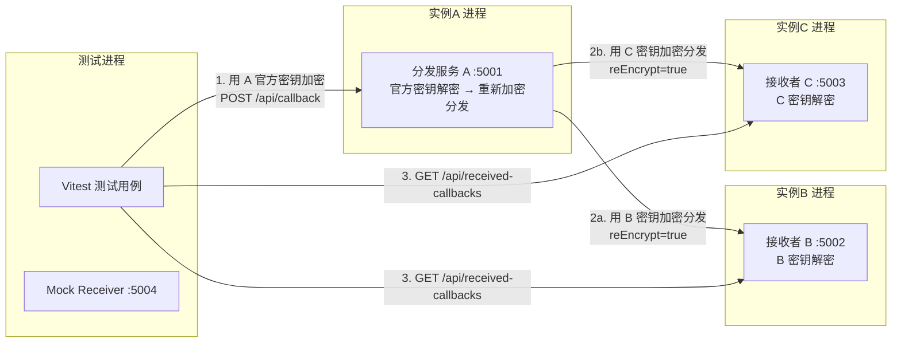
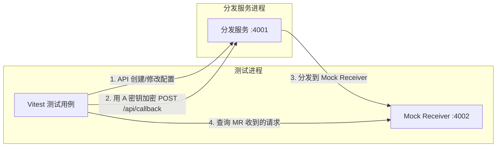

## 产品概述

为腾讯电子签回调分发服务制定完整的测试体系，包含 E2E 测试和集成测试两大部分。同时补全生产代码中缺失的"用下游 encryptKey/signToken 重新加密后分发"逻辑，并将其做成可配置项（reEncrypt 字段），支持明文分发和二次加密分发两种模式。

## 核心功能

### 生产代码补全

- 新增 AES-256-CBC 加密函数和签名生成函数（解密的逆操作）
- dispatch.service.ts 分发前根据下游配置的 `reEncrypt` 字段决定：true 时用下游 encryptKey/signToken 重新加密签名后分发 `{ encrypt: "..." }` + query 签名参数；false 时直接发送明文 TSignCallbackMessage
- DispatchConfig 类型新增 `reEncrypt?: boolean` 字段，前后端类型同步
- 前端弹窗表单新增"二次加密分发"开关

### E2E 测试

- 通过 API 创建/修改/删除/启用/禁用回调配置，发送人工构造的加密回调请求，验证配置变更实时生效
- 验证 msgTypes 事件过滤：选中事件被分发，未选中被拦截
- 验证 unknownMsgTypePolicy 策略：dispatch 模式放行、discard 模式丢弃
- 验证 reEncrypt 配置：开启时下游收到加密格式、关闭时收到明文

### 集成测试

- 启动三个分发服务实例：A(5001) 主分发器、B(5002) 接收者 1、C(5003) 接收者 2
- A 的 callbacks.json 配置 B（reEncrypt=true）和 C（reEncrypt=true）为下游
- 测试脚本用 A 的官方密钥加密消息 POST 到 A，A 解密后分别用 B/C 的密钥重新加密分发
- B 和 C 用各自密钥解密成功，通过查询 API 验证消息已送达
- 验证禁用某个下游、事件过滤等场景的正确性

## 技术栈

- **测试框架**: Vitest 2.x（原生 TypeScript 支持，与项目 TS5 + ES2020 + commonjs 栈兼容）
- **HTTP 请求**: axios（项目已有依赖，测试中复用）
- **进程管理**: Node.js child_process.spawn（启动多个后端实例）
- **加密算法**: Node.js 内置 crypto 模块（AES-256-CBC，与现有 decryptAES256CBC 对称）

## 实现方案

### 整体策略

分两条线并行推进：

1. **补全生产功能**（前置条件）：在 `crypto.util.ts` 新增加密函数 `encryptAES256CBC` 和签名生成函数 `generateSignature`（解密/验签的精确逆操作）；`http.util.ts` 扩展 `params` 支持；`dispatch.service.ts` 根据 `callbackConfig.reEncrypt` 决定是否重新加密；`app.config.ts` 支持 `CONFIG_DIR` 环境变量以支持多实例隔离。

2. **构建测试体系**：基于 Vitest，编写测试辅助模块（mock-receiver 记录收到的请求、test-utils 管理临时配置/子进程/健康检查、crypto-helpers 构造加密回调请求），在此基础上编写 E2E 和集成测试用例。

### 关键技术决策

**1. encryptAES256CBC 实现（decryptAES256CBC 的精确逆操作）**

当前解密逻辑（crypto.util.ts 第 3-22 行）的数据格式为：

- 16 字节随机数 + 4 字节消息长度(BigEndian) + 消息内容 + PKCS7 填充
- 密钥：`Base64Decode(encodingAESKey + "=")` 得到 32 字节 AES key
- IV：AES key 前 16 字节

加密函数必须严格遵循此格式，确保下游用标准的 `decryptAES256CBC` 即可解密。

**2. generateSignature 实现（verifySignature 的对称操作）**

当前验签逻辑（crypto.util.ts 第 25-36 行）：`SHA1(sort([token, timestamp, nonce, encrypt]).join(''))`。签名生成函数使用相同算法，返回 hex 字符串。

**3. dispatch.service.ts 重新加密分发**

核心改造在第 26-33 行。当 `callbackConfig.reEncrypt === true` 且 `callbackConfig.encryptKey` 存在时：

- 将 `message` JSON 序列化后调用 `encryptAES256CBC` 加密
- 生成 timestamp、nonce，用 `callbackConfig.signToken` 和加密结果生成 `msg_signature`
- 发送 `{ encrypt: encryptedStr }` body + `?timestamp=&nonce=&msg_signature=` query 参数
- 否则保持现有明文发送行为

**4. CONFIG_DIR 环境变量支持**

`app.config.ts` 第 5 行从硬编码改为 `process.env.CONFIG_DIR || path.resolve(__dirname, '../../../config')`，仅 1 行变更，零影响现有行为。`logger.service.ts` 第 5 行同理支持 `LOG_DIR` 环境变量。

**5. received-callbacks 查询 API**

在 `callback.controller.ts` 中新增内存队列（最多 100 条），每次 `handleCallback` 成功解密消息后将其 push 入队列。暴露 `GET /api/received-callbacks` 供测试断言，`DELETE /api/received-callbacks` 清空队列。此 API 仅用于测试验证，生产环境不影响正常流程。

**6. 集成测试多实例架构**



- 每个实例使用独立的临时 config 目录（`fs.mkdtempSync`），含独立的 `app.json`（不同端口和密钥）、`callbacks.json`（A 配有 B/C 下游，B/C 为空）、`tags.json`
- 实例通过 `child_process.spawn` 启动 `ts-node-dev`，传入 `CONFIG_DIR` 和 `LOG_DIR` 环境变量
- Mock Receiver（端口 5004）作为可选的明文验证接收器，用于 reEncrypt=false 场景
- 测试前后通过 `afterAll` 可靠清理子进程和临时目录

### E2E 测试架构



- Mock Receiver 是轻量 express 服务，记录所有 POST body 到内存数组
- E2E 测试不需要下游走完整解密流程，仅验证分发行为是否发生

## 实现注意事项

1. **加密对称性验证**：`encryptAES256CBC` 必须与 `decryptAES256CBC` 完全对称，编写单元测试验证 `decrypt(encrypt(msg)) === msg`
2. **端口隔离**：E2E 使用 4001-4010，集成测试使用 5001-5010，与开发 3001 不冲突
3. **异步分发等待**：`callback.controller.ts` 第 32 行先返回 200 再异步分发，测试中通过 Mock Receiver 的 `waitForRequests(count, timeoutMs)` 方法等待，避免固定 sleep
4. **测试配置隔离**：每个测试套件使用独立的 `fs.mkdtempSync` 临时目录，`afterAll` 清理
5. **重试配置**：测试用回调配置设置 `retryCount=0`，避免重试延迟拉长测试时间
6. **进程清理**：`afterAll` 中通过 `process.kill(-pid)` 清理进程组，防止僵尸进程和端口泄漏
7. **tsconfig 兼容**：项目使用 `commonjs` 模块，Vitest 配置需设置 `pool: 'forks'` 避免 ESM/CJS 冲突

## 目录结构

```
backend/
├── src/
│   ├── config/
│   │   └── app.config.ts              # [MODIFY] 第 5 行 CONFIG_DIR 支持环境变量：const CONFIG_DIR = process.env.CONFIG_DIR || path.resolve(...)。getConfigDir() 返回该值。
│   ├── types/
│   │   └── config.types.ts            # [MODIFY] DispatchConfig 接口新增 reEncrypt?: boolean 字段（第 25 行 signToken 之后）
│   ├── utils/
│   │   ├── crypto.util.ts             # [MODIFY] 新增 encryptAES256CBC(message, encodingAESKey): string 加密函数（decryptAES256CBC 的逆操作，格式：16字节随机 + 4字节长度 + 消息 + PKCS7）和 generateSignature(token, timestamp, nonce, encrypt): string 签名生成函数
│   │   └── http.util.ts               # [MODIFY] HttpPostOptions 新增 params?: Record<string, string> 可选字段；httpPostWithRetry 中将 params 传入 axios config
│   ├── services/
│   │   ├── dispatch.service.ts        # [MODIFY] 核心改造。引入 encryptAES256CBC/generateSignature/generateSignToken；分发前判断 callbackConfig.reEncrypt && callbackConfig.encryptKey，为 true 时加密消息 + 生成签名参数通过 params 传递，否则保持明文
│   │   └── logger.service.ts          # [MODIFY] 第 5 行 LOG_DIR 支持环境变量：const LOG_DIR = process.env.LOG_DIR || path.resolve(...)
│   ├── controllers/
│   │   ├── callback.controller.ts     # [MODIFY] 新增 receivedCallbacks 内存数组（最多 100 条）；handleCallback 解密成功后 push 消息；新增 getReceivedCallbacks 和 clearReceivedCallbacks 处理函数
│   │   └── config.controller.ts       # [MODIFY] createCallback 解构新增 reEncrypt 字段
│   └── app.ts                         # [MODIFY] 新增 GET /api/received-callbacks 和 DELETE /api/received-callbacks 路由
├── tests/
│   ├── helpers/
│   │   ├── mock-receiver.ts           # [NEW] 轻量级 express 测试接收服务器。POST / 记录请求 body/headers/timestamp 到内存数组；GET /received 返回所有记录；DELETE /received 清空；waitForRequests(count, timeoutMs) 轮询等待指定数量请求到达。提供 createMockReceiver(port) 工厂函数。
│   │   ├── test-utils.ts             # [NEW] 测试工具集。createTestConfig(configDir, options) 生成临时 app.json/callbacks.json/tags.json；startDispatcher(port, configDir, logDir) 通过 spawn 启动后端子进程并轮询 /api/health 等待就绪；stopDispatcher(childProcess) 杀进程；waitFor(ms) 延时工具；cleanupDir(dir) 清理临时目录。
│   │   └── crypto-helpers.ts          # [NEW] 构造加密回调请求工具。buildEncryptedCallback(message, encodingAESKey, token) 调用 encryptAES256CBC 加密消息、generateSignature 生成签名，返回 { body: { encrypt }, query: { timestamp, nonce, msg_signature } }；buildMockMessage(msgType, msgData?) 构造 TSignCallbackMessage。
│   ├── e2e/
│   │   └── config-dispatch.e2e.test.ts # [NEW] E2E 测试套件。beforeAll 启动分发服务(4001) + Mock Receiver(4002)；用例：(1)创建配置后回调被分发到 Mock Receiver (2)禁用配置后不再分发 (3)修改 msgTypes 后事件过滤生效 (4)unknownMsgTypePolicy=dispatch 放行未知事件 (5)unknownMsgTypePolicy=discard 丢弃未知事件 (6)删除配置后不再分发
│   └── integration/
│       └── multi-instance.integration.test.ts # [NEW] 集成测试套件。beforeAll 启动 A(5001) + B(5002) + C(5003) 三个分发服务实例；用例：(1)回调消息同时加密分发到 B 和 C，B/C 解密成功 (2)禁用 B 后仅 C 收到 (3)B 配置 msgTypes 过滤时只收到匹配事件 (4)reEncrypt=false 时下游收到明文
├── vitest.config.ts                    # [NEW] Vitest 配置。include: ['tests/**/*.test.ts']；testTimeout: 30000；pool: 'forks'；环境 node
└── package.json                        # [MODIFY] devDependencies 新增 vitest；scripts 新增 "test"、"test:e2e"、"test:integration"
frontend/src/
├── types/
│   └── api.types.ts                    # [MODIFY] DispatchConfig 接口新增 reEncrypt?: boolean
└── pages/
    └── CallbackManagementPage.tsx      # [MODIFY] INITIAL_FORM_DATA 新增 reEncrypt: false；弹窗表单新增"二次加密分发"Switch 开关，置于 encryptKey/signToken 之前
```

## 关键代码结构

```typescript
// backend/src/utils/crypto.util.ts - 新增加密函数签名
export function encryptAES256CBC(message: string, encodingAESKey: string): string;
// 格式：16字节 crypto.randomBytes + 4字节 msg.length BigEndian + msg Buffer + PKCS7 padding
// 密钥：Buffer.from(encodingAESKey + '=', 'base64')，IV：key.subarray(0, 16)
// 返回 Base64 编码的加密结果

export function generateSignature(
  token: string, timestamp: string, nonce: string, encrypt: string
): string;
// SHA1(sort([token, timestamp, nonce, encrypt]).join(''))，返回 hex

// tests/helpers/mock-receiver.ts - Mock 接收服务器接口
interface ReceivedRequest {
  body: any;
  headers: Record<string, string>;
  timestamp: number;
}
interface MockReceiver {
  readonly port: number;
  start(): Promise<void>;
  stop(): Promise<void>;
  getReceived(): ReceivedRequest[];
  clearReceived(): void;
  waitForRequests(count: number, timeoutMs?: number): Promise<ReceivedRequest[]>;
}
```

## Agent Extensions

### Skill

- **backend-patterns**
- 用途：参考 Node.js/Express 后端测试最佳实践，确保 Mock 服务器、进程管理、配置隔离的代码质量
- 预期结果：测试辅助模块符合工程规范，错误处理和资源清理完善

### MCP

- **playwright**
- 用途：测试全部完成后，辅助验证前端配置页面新增 reEncrypt 开关的交互是否正确
- 预期结果：通过浏览器自动化确认前端弹窗表单中 reEncrypt 开关能正确显示和提交