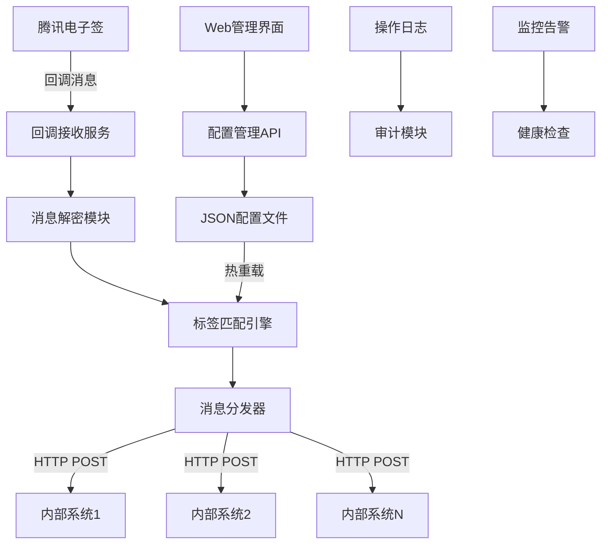

## 产品概述

腾讯电子签回调分发服务是一个中间件系统，用于接收腾讯电子签的全量回调消息，并根据配置的标签规则智能分发到不同的内部业务系统。

## 核心功能

- **回调接收与解密**：接收腾讯电子签官方回调，解密消息内容
- **智能消息分发**：根据标签匹配规则将消息转发到配置的目标系统
- **回调地址配置管理**：Web界面管理回调目标地址，支持增删改查
- **标签管理系统**：管理分发标签，支持精确匹配、包含匹配、正则表达式匹配
- **配置热重载**：支持配置文件热更新，无需重启服务
- **操作审计日志**：记录所有配置变更和分发操作
- **配置版本管理**：支持配置回滚和版本对比
- **部署支持**：提供Docker和Kubernetes部署配置

## 技术栈选择

- **后端框架**：Node.js + Express.js + TypeScript
- **前端框架**：Next.js + TypeScript + TDesign React
- **配置存储**：JSON文件 + 文件监听热重载
- **消息分发**：HTTP POST转发 + 重试机制
- **部署方案**：Docker + Kubernetes

## 实现方案

### 系统架构

采用前后端分离的微服务架构：

- **API服务层**：处理回调接收、消息解密、配置管理
- **分发引擎**：负责消息路由和转发
- **Web管理界面**：配置管理和监控面板
- **配置存储**：JSON文件存储，支持热重载

### 核心技术决策

1. **消息解密处理**：基于腾讯电子签官方加密规范实现AES-256-CBC解密和HMAC-SHA256签名验证
2. **标签匹配引擎**：支持多种匹配模式的规则引擎，支持JSONPath字段匹配
3. **分发可靠性**：实现重试机制、失败队列和监控告警
4. **配置热重载**：使用fs.watch监听配置文件变化
5. **性能优化**：异步处理、连接池复用、内存缓存
6. **消息类型适配**：完整支持合同、印章、模板等所有官方回调类型

### 实现细节

- **安全性**：输入验证、签名校验、HTTPS传输
- **可靠性**：重试机制、熔断器、健康检查
- **监控性**：结构化日志、性能指标、错误追踪
- **扩展性**：插件化架构、配置驱动、水平扩展支持

## 架构设计

### 系统组件图



### 数据流设计

1. **回调接收**：腾讯电子签 → 回调接收服务 → 消息解密
2. **标签匹配**：解密消息 → 标签匹配引擎 → 获取目标地址列表
3. **消息分发**：目标地址 → HTTP POST转发 → 重试处理
4. **配置管理**：Web界面 → API服务 → JSON文件 → 热重载

## 目录结构

### 项目整体结构

```
tsign-callback-dispatcher/
├── backend/                          # 后端服务
│   ├── src/
│   │   ├── controllers/
│   │   │   ├── callback.controller.ts    # [NEW] 回调接收控制器。处理腾讯电子签回调请求，验证签名，调用解密服务
│   │   │   ├── config.controller.ts      # [NEW] 配置管理控制器。提供回调地址和标签的CRUD API接口
│   │   │   └── health.controller.ts      # [NEW] 健康检查控制器。提供服务状态检查和监控接口
│   │   ├── services/
│   │   │   ├── decrypt.service.ts        # [NEW] 消息解密服务。实现腾讯电子签回调消息解密逻辑
│   │   │   ├── dispatch.service.ts       # [NEW] 消息分发服务。实现HTTP POST转发，重试机制，失败处理
│   │   │   ├── config.service.ts         # [NEW] 配置管理服务。处理JSON配置文件读写，热重载，版本管理
│   │   │   └── tag-matcher.service.ts    # [NEW] 标签匹配服务。实现多种匹配规则（精确、包含、正则）
│   │   ├── middleware/
│   │   │   ├── auth.middleware.ts        # [NEW] 认证中间件。验证请求签名和权限
│   │   │   ├── logger.middleware.ts      # [NEW] 日志中间件。记录请求响应和操作审计
│   │   │   └── validator.middleware.ts   # [NEW] 参数验证中间件。验证API请求参数
│   │   ├── types/
│   │   │   ├── callback.types.ts         # [NEW] 回调相关类型定义。定义腾讯电子签回调消息结构
│   │   │   ├── config.types.ts           # [NEW] 配置相关类型定义。定义回调地址、标签、匹配规则类型
│   │   │   └── common.types.ts           # [NEW] 通用类型定义。定义API响应、错误处理等通用类型
│   │   ├── utils/
│   │   │   ├── crypto.util.ts            # [NEW] 加密工具。提供签名验证、消息解密等加密功能
│   │   │   ├── http.util.ts              # [NEW] HTTP工具。提供HTTP请求封装、重试逻辑
│   │   │   └── file-watcher.util.ts      # [NEW] 文件监听工具。实现配置文件热重载功能
│   │   ├── config/
│   │   │   └── app.config.ts             # [NEW] 应用配置。定义服务端口、日志级别等应用配置
│   │   └── app.ts                        # [NEW] 应用入口。Express应用初始化，中间件配置，路由注册
│   ├── package.json                      # [NEW] 后端依赖配置
│   └── tsconfig.json                     # [NEW] TypeScript配置
├── frontend/                         # Next.js前端应用
│   ├── src/
│   │   ├── app/                          # Next.js App Router
│   │   │   ├── callback-management/
│   │   │   │   └── page.tsx              # [NEW] 回调管理页面。回调地址配置管理主页面
│   │   │   ├── tag-management/
│   │   │   │   └── page.tsx              # [NEW] 标签管理页面。标签配置管理主页面
│   │   │   ├── dashboard/
│   │   │   │   └── page.tsx              # [NEW] 仪表板页面。系统监控和统计主页面
│   │   │   ├── settings/
│   │   │   │   └── page.tsx              # [NEW] 系统设置页面。全局配置和系统参数设置
│   │   │   ├── api/                      # Next.js API Routes
│   │   │   │   ├── callbacks/
│   │   │   │   │   └── route.ts          # [NEW] 回调配置API路由。代理后端API调用
│   │   │   │   └── tags/
│   │   │   │       └── route.ts          # [NEW] 标签管理API路由。代理后端API调用
│   │   │   ├── layout.tsx                # [NEW] 根布局组件。全局布局和样式配置
│   │   │   ├── page.tsx                  # [NEW] 首页。系统概览和快速导航
│   │   │   └── globals.css               # [NEW] 全局样式。Tailwind CSS和自定义样式
│   │   ├── components/
│   │   │   ├── CallbackConfig/
│   │   │   │   ├── CallbackList.tsx      # [NEW] 回调地址列表组件。展示回调地址列表，支持搜索、分页
│   │   │   │   ├── CallbackForm.tsx      # [NEW] 回调地址表单组件。新增/编辑回调地址的表单
│   │   │   │   └── CallbackTest.tsx      # [NEW] 回调测试组件。测试回调地址连通性
│   │   │   ├── TagManager/
│   │   │   │   ├── TagList.tsx           # [NEW] 标签列表组件。展示标签列表，支持增删改查
│   │   │   │   ├── TagForm.tsx           # [NEW] 标签表单组件。新增/编辑标签的表单
│   │   │   │   └── TagRuleEditor.tsx     # [NEW] 标签规则编辑器。配置标签匹配规则（精确、包含、正则）
│   │   │   ├── Dashboard/
│   │   │   │   ├── Overview.tsx          # [NEW] 概览仪表板。展示系统运行状态、分发统计
│   │   │   │   ├── LogViewer.tsx         # [NEW] 日志查看器。查看操作日志和分发记录
│   │   │   │   └── ConfigHistory.tsx     # [NEW] 配置历史。查看配置变更历史，支持版本回滚
│   │   │   ├── Layout/
│   │   │   │   ├── Header.tsx            # [NEW] 页面头部组件。导航菜单、用户信息
│   │   │   │   ├── Sidebar.tsx           # [NEW] 侧边栏组件。功能模块导航
│   │   │   │   └── MainLayout.tsx        # [NEW] 主布局组件。整体页面布局结构
│   │   │   └── ui/                       # 通用UI组件
│   │   │       ├── Button.tsx            # [NEW] 按钮组件。统一的按钮样式和交互
│   │   │       ├── Input.tsx             # [NEW] 输入框组件。表单输入控件
│   │   │       ├── Modal.tsx             # [NEW] 模态框组件。弹窗和对话框
│   │   │       └── Table.tsx             # [NEW] 表格组件。数据展示和操作
│   │   ├── lib/
│   │   │   ├── api.ts                    # [NEW] API客户端。封装后端API调用，统一错误处理
│   │   │   ├── utils.ts                  # [NEW] 工具函数。通用工具和辅助函数
│   │   │   └── validations.ts            # [NEW] 验证规则。表单验证和数据校验
│   │   ├── types/
│   │   │   └── api.types.ts              # [NEW] API类型定义。定义前后端交互的数据结构
│   │   └── hooks/
│   │       ├── useCallbacks.ts           # [NEW] 回调配置Hook。管理回调配置状态和操作
│   │       ├── useTags.ts                # [NEW] 标签管理Hook。管理标签状态和操作
│   │       └── useApi.ts                 # [NEW] API调用Hook。封装API调用逻辑
│   ├── public/                           # 静态资源
│   │   ├── favicon.ico                   # [NEW] 网站图标
│   │   └── logo.png                      # [NEW] 系统Logo
│   ├── package.json                      # [NEW] 前端依赖配置
│   ├── tsconfig.json                     # [NEW] TypeScript配置
│   ├── tailwind.config.js                # [NEW] Tailwind CSS配置
│   ├── next.config.js                    # [NEW] Next.js配置
│   └── postcss.config.js                 # [NEW] PostCSS配置
├── config/                           # 配置文件目录
│   ├── callbacks.json                    # [NEW] 回调地址配置文件。存储回调目标地址和相关配置
│   ├── tags.json                         # [NEW] 标签配置文件。存储标签定义和匹配规则
│   └── app.json                          # [NEW] 应用配置文件。存储全局应用配置参数
├── docker/
│   ├── Dockerfile.backend                # [NEW] 后端Docker构建文件
│   ├── Dockerfile.frontend               # [NEW] 前端Docker构建文件
│   └── docker-compose.yml               # [NEW] Docker Compose配置。本地开发环境一键启动
├── k8s/
│   ├── backend-deployment.yaml          # [NEW] 后端K8s部署配置
│   ├── frontend-deployment.yaml         # [NEW] 前端K8s部署配置
│   ├── configmap.yaml                   # [NEW] K8s配置映射。挂载配置文件到容器
│   └── service.yaml                     # [NEW] K8s服务配置。定义服务暴露和负载均衡
├── docs/
│   ├── API.md                           # [NEW] API文档。详细的接口文档和使用说明
│   ├── DEPLOYMENT.md                    # [NEW] 部署文档。Docker和K8s部署指南
│   └── CONFIGURATION.md                 # [NEW] 配置文档。配置文件格式和参数说明
├── package.json                         # [NEW] 项目根配置
└── README.md                            # [NEW] 项目说明文档
```

## 关键代码结构

### 腾讯电子签回调消息类型定义

基于官方文档适配的完整消息结构：

```typescript
// 通用回调消息外层结构
interface TSignCallbackMessage {
  MsgId: string;          // 消息唯一ID，32位字符串
  MsgType: string;        // 消息类型，区分具体场景
  MsgVersion: string;     // 消息版本，通常为 "CustomApp" 或 "ThirdPartyApp"
  MsgData: any;          // 消息数据，根据MsgType不同而不同
}

// 加密回调消息结构（原始接收格式）
interface EncryptedCallbackMessage {
  encrypt: string;        // AES-256-CBC加密后的Base64编码消息体
}

// 合同状态变动回调 (MsgType: "FlowStatusChange")
interface FlowStatusChangeData {
  FlowId: string;
  DocumentId: string;
  CallbackType: string;
  FlowName: string;
  FlowDescription: string;
  FlowType: string;
  FlowCallbackStatus: number;    // 合同状态码
  Unordered: boolean;
  CreateOn: number;              // Unix时间戳
  UpdatedOn: number;
  DeadLine: number;
  UserId: string;
  RecipientId: string;
  Operate: string;               // 操作类型：sign/reject/cancel等
  UserData: string;
  Approvers: ApproverInfo[];
  CallbackUrl: string;
  FlowGroupMessage?: FlowGroupInfo;  // 合同组信息（可选）
}

// 签署人信息结构
interface ApproverInfo {
  UserId: string;
  RecipientId: string;
  ApproverType: number;          // 0:企业, 1:个人
  OrganizationName: string;
  Required: boolean;
  ApproverName: string;
  ApproverMobile: string;
  ApproverIdCardType: string;
  ApproverIdCardNumber: string;
  ApproveCallbackStatus: number; // 签署人状态码
  ApproveMessage: string;
  ApproveTime: number;           // Unix时间戳
  VerifyChannel: string;
}

// 印章操作回调 (MsgType: "OperateSeal")
interface OperateSealData {
  OrganizationId?: string;
  OperatorUserId?: string;
  SealId: string;
  SealName: string;
  SealType: 'OFFICIAL' | 'CONTRACT' | 'ORGANIZATION_SEAL' | 'LEGAL_PERSON_SEAL' | 'FINANCE' | 'PERSONNEL';
  Operate: 'Create' | 'Delete' | 'Disable' | 'Enable' | 'Update' | 'Valid' | 'Invalid';
  AuthorizedUsers?: AuthorizedUser[];
  // 审核相关字段
  ReviewStatus?: 'PENDING' | 'PASS' | 'REJECT' | 'CHECKING';
  ReviewReason?: string;
  NodeName?: string;
  NodeStatus?: string;
  ReviewUserId?: string;
}

// 模板操作回调 (MsgType: "TemplateAdd" | "TemplateUpdate" | "TemplateDelete" | "TemplateAvailable")
interface TemplateOperationData {
  OrganizationId: string;
  OperatorUserId: string;
  TemplateId: string;
  ShareTemplateId: string;
  TemplateName: string;
  UserData: string;
  // 特定操作的时间字段
  CreateTime?: number;           // TemplateAdd
  UpdateTime?: number;           // TemplateUpdate
  DeleteTime?: number;           // TemplateDelete
  OperateOn?: number;            // TemplateAvailable
  TemplateStatus?: 'DISABLE' | 'ENABLE';  // TemplateAvailable
  UserFlowTypeId?: string;       // TemplateAdd, TemplateUpdate
}

// 用印记录回调 (MsgType: "SealUse")
interface SealUseData {
  SealUseCallbackRecords: SealUseRecord[];
}

interface SealUseRecord {
  SealId: string;
  SealName: string;
  FlowId: string;
  FlowName: string;
  SignCount: number;
  CreatorId: string;
  CreatorName: string;
  SignTime: number;
  AuditUserId: string;
  AuditUserName: string;
  AuditTime: number;
  OrganizationId: string;
}

// 消息类型枚举
enum CallbackMsgType {
  // 合同相关
  FLOW_STATUS_CHANGE = 'FlowStatusChange',
  FLOW_COST = 'FlowCost',
  FORWARD_FLOW = 'ForwardFLow',
  CREATE_FLOW_REVIEW = 'CreateFlowReview',
  RECEIVE_FLOW = 'ReceiveFlow',
  APPROVER_DEADLINE_EXPIRED = 'ApproverDeadlineExpired',
  CANCEL_FLOWS = 'CancelFlows',
  DOCUMENT_FILL = 'DocumentFill',
  FLOW_GROUP_STATUS_CHANGE = 'FlowGroupStatusChange',
  REVIEWER_FLOW_READ = 'ReviewerFlowRead',
  
  // 印章相关
  OPERATE_SEAL = 'OperateSeal',
  EMPLOYEE_SEAL_AUTH = 'EmployeeSealAuth',
  SEAL_USE = 'SealUse',
  
  // 模板相关
  TEMPLATE_ADD = 'TemplateAdd',
  TEMPLATE_UPDATE = 'TemplateUpdate',
  TEMPLATE_DELETE = 'TemplateDelete',
  TEMPLATE_AVAILABLE = 'TemplateAvailable'
}
```

### 分发配置结构

```typescript
interface DispatchConfig {
  id: string;
  name: string;
  url: string;
  tags: string[];
  matchRules: TagMatchRule[];    // 支持多个匹配规则
  enabled: boolean;
  retryCount: number;
  timeout: number;
  headers?: Record<string, string>;  // 自定义请求头
  msgTypes?: CallbackMsgType[];      // 指定接收的消息类型
}

interface TagMatchRule {
  field: string;                     // 匹配字段路径，如 "MsgData.FlowName" 或 "MsgType"
  operator: 'exact' | 'contains' | 'regex' | 'in';
  value: string | string[];          // 匹配值
  tags: string[];                    // 匹配成功时分配的标签
}
```

### 标签匹配引擎接口

```typescript
interface TagMatcher {
  match(message: TSignCallbackMessage, rules: TagMatchRule[]): string[];  // 返回匹配的标签数组
}

interface TagMatchRule {
  id: string;
  name: string;
  field: string;                     // 匹配字段路径，支持嵌套，如 "MsgData.FlowName"
  operator: 'exact' | 'contains' | 'regex' | 'in' | 'exists';
  value: string | string[];          // 匹配值
  tags: string[];                    // 匹配成功时分配的标签
  enabled: boolean;
  description?: string;
}

// 消息解密服务接口
interface DecryptService {
  decrypt(encryptedMessage: EncryptedCallbackMessage, key: string): TSignCallbackMessage;
  verifySignature(body: string, signature: string, token: string): boolean;
}

// 分发服务接口
interface DispatchService {
  dispatch(message: TSignCallbackMessage, configs: DispatchConfig[]): Promise<DispatchResult[]>;
}

interface DispatchResult {
  configId: string;
  url: string;
  success: boolean;
  statusCode?: number;
  error?: string;
  retryCount: number;
  timestamp: number;
}
```

## 设计风格

采用现代企业级管理系统设计风格，基于TDesign设计语言和Next.js全栈框架，提供专业、高效的配置管理体验。TDesign是腾讯出品的企业级设计体系，与腾讯电子签产品风格一致。

### Next.js架构优势

- **全栈集成**：前后端API路由统一管理，简化部署和维护
- **服务端渲染**：提升首屏加载速度和SEO优化
- **App Router**：基于文件系统的路由，支持嵌套布局和并行路由
- **API Routes**：内置API端点，可作为后端服务的代理层
- **性能优化**：自动代码分割、图片优化、字体优化

### 整体布局

- **顶部导航**：系统标题、功能导航、用户信息
- **左侧菜单**：功能模块导航（回调配置、标签管理、监控面板、系统设置）
- **主内容区**：表格列表、表单编辑、图表展示
- **操作反馈**：消息提示、确认对话框、加载状态

### 页面设计

1. **回调配置页面**：表格展示回调地址列表，支持搜索过滤，右侧抽屉式表单编辑
2. **标签管理页面**：卡片式标签展示，模态框编辑标签规则，可视化规则配置器
3. **监控面板**：统计卡片、实时图表、日志列表，响应式布局
4. **系统设置**：分组表单、配置验证、版本历史时间轴

### 交互设计

- **表格操作**：行内编辑、批量操作、快速筛选
- **表单验证**：实时验证、错误提示、智能补全
- **状态反馈**：加载动画、成功提示、错误处理
- **响应式**：适配桌面和平板设备

## 推荐扩展工具

### Skill扩展

- **backend-patterns**
- 用途：指导Node.js后端架构设计，API设计最佳实践
- 预期结果：生成符合企业级标准的后端代码结构和设计模式

- **frontend-patterns** 
- 用途：指导Next.js全栈开发模式，组件设计和状态管理
- 预期结果：创建可维护、高性能的Next.js应用架构

- **coding-standards**
- 用途：确保TypeScript代码质量，统一编码规范
- 预期结果：生成符合最佳实践的高质量代码

### MCP扩展

- **chrome-devtools**
- 用途：测试Web界面功能，验证用户交互流程
- 预期结果：确保前端界面功能正常，用户体验良好